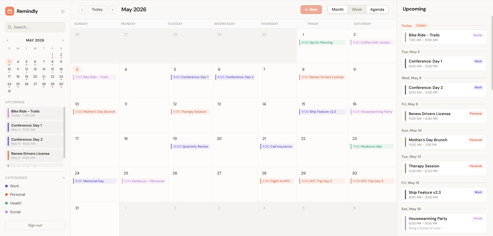

# Remindly

Remindly is a cross-platform calendar and task manager with a polished web app, native iOS app with Live Activities, and a Supabase backend.



## What's included

- **`apps/web`** — Next.js web app with month/week/agenda views, event and task creation, category colors, repeat rules, and reminder offsets.
- **`apps/ios`** — Native SwiftUI app with Supabase sync, local notifications, ActivityKit Live Activities, and a WidgetKit widget.
- **`supabase`** — Database migration, row-level security policies, and an Edge Function that dispatches due reminders to APNs.
- **`packages/shared`** — Shared TypeScript logic for recurrence, reminder offsets, and Live Activity state.

## First-time setup

Install dependencies:

```powershell
npm install
```

Create the web env file:

```powershell
Copy-Item apps\web\.env.example apps\web\.env.local
```

Fill in your Supabase project credentials:

```env
NEXT_PUBLIC_SUPABASE_URL=https://your-project.supabase.co
NEXT_PUBLIC_SUPABASE_ANON_KEY=your-anon-key
```

Start the web app:

```powershell
npm run dev:web
```

## Supabase setup

```powershell
supabase login
supabase link --project-ref your-project-ref
supabase db push
```

Set Edge Function secrets and deploy the reminder dispatcher:

```powershell
supabase secrets set --env-file supabase\functions\dispatch-reminders\.env
supabase functions deploy dispatch-reminders
```

Schedule `dispatch-reminders` to run once per minute in Supabase Scheduled Functions. If you set `CRON_SECRET`, pass it as a bearer token when invoking the function.

## iOS setup

See [apps/ios/README.md](apps/ios/README.md) for Xcode target configuration. The iOS app requires a real device, an Apple Developer account, and Push Notifications + Live Activities entitlements enabled.

## Useful commands

```powershell
npm run dev:web      # start web app at localhost:3000
npm run typecheck    # TypeScript check across all packages
npm run test         # run test suite
```

## Known limits

- No Apple Calendar / Google Calendar import yet.
- Recurring reminder dispatch works for simple rules; complex long-term recurrence should be validated before relying on it in production.
- Critical Alerts are not used (requires a special Apple entitlement).
